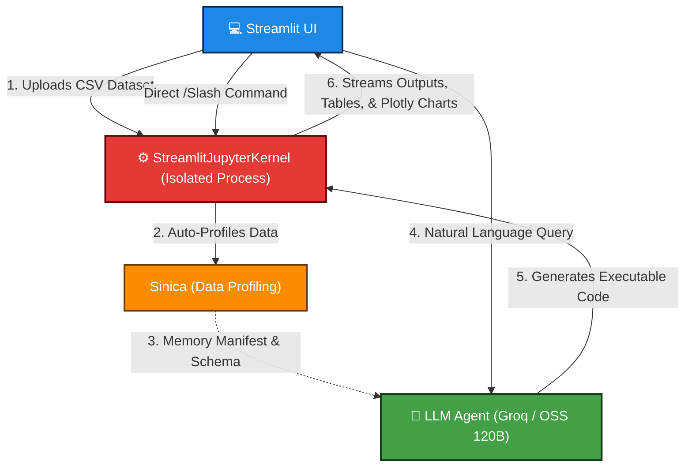

<div align="center">
  
  <h1>Zeno 2</h1>
</div>

<!-- Tech Stack & System Badges -->
[](https://www.python.org/)
[](https://streamlit.io/)
[](https://jupyter.org/)
[](https://groq.com/)
[](https://www.langchain.com/)
[](https://plotly.com/)
[](https://github.com/sarvamm/zeno-2)

<!-- Repository & Status Badges -->
[](LICENSE)
[](https://github.com/sarvamm/zeno-2/stargazers)

**Zeno 2** is an intelligent, conversational data analysis platform built with Streamlit, LangChain, and an isolated Jupyter Kernel background runtime. By bridging open-source 120B LLMs hosted on Groq with live stateful execution and automated data profiling, Zeno 2 allows users to explore datasets through natural language queries, direct Python commands, and interactive visual outputs.

---

## Key Features

* **Automated Data Profiling (`sinica`)**: Instant data summaries, schema detection, and automated data alert generation upon file upload using the custom `sinica` library.
* **Stateful Jupyter Kernel Runtime**: Background kernel managed via `jupyter_client` maintains full in-memory execution context (DataFrames, variables, plots, and models) across conversation turns.
* **Context-Aware LLM Agent**: Powered by OSS 120B models via Groq API and LangChain. The agent inspects kernel variable memory manifests and schema metadata to write precise, context-accurate executable code.
* **Interactive Chat Interface**: Renders streamed code responses, execution logs, formatted tables, and interactive Plotly visualizations directly inside Streamlit.
* **Direct Kernel Commands (`/` Slash Mode)**: Bypass the LLM to execute raw Python code directly inside the active Jupyter kernel space (e.g., `/ df.describe()`).
* **Dynamic Question Recommendations**: Schema-aware analysis prompts automatically generated upon dataset initialization and shuffled dynamically to guide user exploration.
* **Interactive & Exportable Visualizations**: High-contrast, interactive Plotly charts natively supporting panning, zooming, and direct image download.
* **Full Notebook Export**: Export the entire analysis session, executed code blocks, and output history directly into a standard `.ipynb` Jupyter Notebook.

---

## Architecture Overview



---


When a CSV dataset is uploaded:

1. **Kernel Initialization**: A background Python environment (`StreamlitJupyterKernel`) is spawned using `ipykernel`.
2. **Data Injection & Profiling**: The DataFrame is saved to disk and loaded into kernel memory. `sinica.ProfileReport` executes automatically to construct data summary tables and alert lists.
3. **Question Generation**: The schema and initial data summary are passed to the Groq API (OSS 120B model) to output tailored exploratory questions.
4. **Execution & Feedback**: User queries generate code blocks that run inside the kernel. Standard output, errors, and Plotly graphics are captured via `iopub` channels and rendered in Streamlit.

---

## Project Structure

```
zeno-2/
├── app.py                      # Main Streamlit application entry point
├── components/
│   ├── chat_ui.py              # Chat rendering engine and output handlers
│   └── sidebar.py              # Data overview, alerts, and export options
├── services/
│   ├── kernel_manager.py       # StreamlitJupyterKernel manager (ipykernel bridge)
│   └── llm_agent.py            # LangChain & Groq API agent logic
├── utils/
│   └── formatters.py           # Command extractors and prompt history formatters
├── assets/
│   └── chat_intro.png          # UI banner assets
├── requirements.txt            # Python dependencies
└── README.md                   # Documentation

```

---

## Tech Stack

| Component | Technology |
| --- | --- |
| **Frontend UI** | [Streamlit](https://streamlit.io/?utm_source=gemini) |
| **Kernel Manager** | `jupyter_client`, `ipykernel` |
| **Data Profiling** | `sinica` (Custom Profiling Library), `pandas` |
| **LLM Provider** | [Groq API](https://groq.com/?utm_source=gemini) (OSS 120B Model) |
| **Agent Framework** | [LangChain](https://www.langchain.com/?utm_source=gemini) |
| **Visualization** | [Plotly Express & Graph Objects](https://plotly.com/python/?utm_source=gemini) |

---

## Getting Started

### Prerequisites

* **Python 3.10+** installed.
* A **Groq API Key** (Get one at [console.groq.com](https://console.groq.com/?utm_source=gemini)).

### Installation

1. **Clone the Repository**
```bash
git clone https://github.com/sarvamm/zeno-2.git
cd zeno-2

```


2. **Create a Virtual Environment**
```bash
python -m venv venv
source venv/bin/activate  # On Windows: venv\Scripts\activate

```


3. **Install Dependencies**
```bash
pip install -r requirements.txt
pip install sinica

```


4. **Register the Jupyter Kernel**
Ensure `ipykernel` is installed in your active environment:
```bash
python -m ipykernel install --user --name streamlit_env_3_10 --display-name "Streamlit Environment Python"

```


---

## Environment Configuration

Create a `.env` file or configure Streamlit secrets (`.streamlit/secrets.toml`) with your Groq API Key:

```env
GROQ_API_KEY="your_groq_api_key_here"

```

Alternatively, set it via Streamlit secrets (`.streamlit/secrets.toml`):

```toml
API = "your_groq_api_key_here"

```

---

## Running the Application

Launch the Streamlit app:

```bash
streamlit run app.py

```

1. Open your browser at `http://localhost:8501`.
2. Upload any tabular dataset (`.csv`).
3. View automated alerts and summary metrics in the sidebar.
4. Begin asking questions in natural language, selecting generated recommendations, or running direct commands using `/ <python_code>`.

---

## Usage Guide

### Natural Language Queries

Type questions like:

* *"What is the correlation between numerical columns?"*
* *"Build a scatter plot of feature A vs feature B colored by target."*
* *"Identify missing values and clean them."*

### Direct Slash Commands (`/`)

Bypass the LLM to execute Python code instantly in the active Jupyter Kernel:

* `/ df.head(10)`
* `/ df.info()`
* `/ plt.hist(df['column_name'])`

### Exporting Session

At any point during or after analysis, click **Download Jupyter Notebook** in the sidebar to retrieve an `.ipynb` file containing all generated code snippets and execution history.